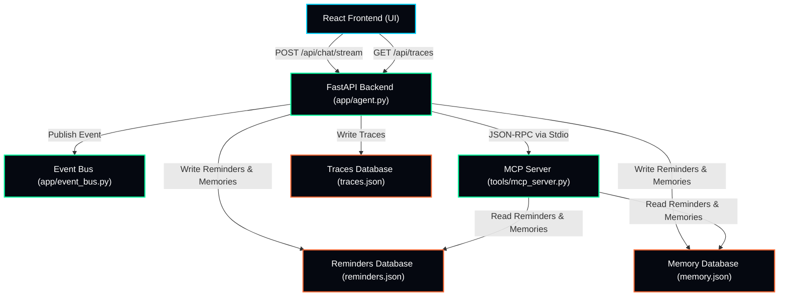

# JARVIS — Joint Cognitive Assistant and Real-Time Telemetry System

[](RELEASE_NOTES_v1.0.0.md)
[]()
[]()
[]()
[]()

JARVIS is an AI-powered operating companion built with the **Google ADK 2.0** framework. It features asynchronous **Agent-to-Agent (A2A) collaboration**, standard **Model Context Protocol (MCP) tool routing**, persistent memory, temporal reminders, system telemetry monitoring, live Server-Sent Events (SSE) streaming, and full production observability.

---

## 🚀 Key Features

* **Agent-to-Agent Collaboration Mesh**: Fully asynchronous routing via a strongly-typed, validated Event Bus where specialized sub-agents (`MemoryAgent`, `ReminderAgent`, `TelemetryAgent`, etc.) collaborate dynamically.
* **MCP Tool Routing**: Extreme security isolation where all system diagnostic tools and database functions are strictly whitelisted and executed over standard JSON-RPC 2.0 Model Context Protocol layers.
* **Real-Time Telemetry**: Real-time extraction of CPU Load, RAM Allocation, Disk Indices, and GPU Performance, complete with alert threshold warnings.
* **Persistent Memory**: Fuzzy-matched semantic recall of user facts using alphabetically sorted `difflib.SequenceMatcher` ratios with uncertainty-flow response logic.
* **Reminder Scheduling**: Offline-first, deterministic natural language date and time parsing (e.g. *"every Sunday at 9 AM"*, *"tomorrow at 5 PM"*).
* **Due Reminder Detection**: Live polling alert banner overlays and badge indicators that trigger immediately in the React UI upon timer expiration.
* **SSE Event Streaming**: Server-Sent Events stream backend agent transitions in real time, with automatic fallback to standard HTTP POST.
* **Trace Viewer**: Interactive visual timeline detailing step execution durations, agent communications, and request timelines.
* **Diagnostics Export**: Live download of core diagnostics reports as a structured JSON file or formatted printable PDF.
* **Demo Mode**: Integrates a collapsible preset panel to easily run automated demonstration query cases.
* **Security Hardening**: Blacklisted pattern matching for prompt injection guards, Pydantic schema validation, and pre-commit Semgrep scanning.
* **Cloud Run Readiness**: Bundled with production `Dockerfile`, `docker-compose.yml`, `cloudbuild.yaml`, and a complete deployment manual.

---

## 📐 Architecture & Data Flow



---

## 📷 Screenshots

| Feature | Interface Screenshot |
| --- | --- |
| **Main Dashboard & Telemetry** | *[Placeholder: Main Chat Interface and circular gauge meters]* |
| **Memory Viewer Panel** | *[Placeholder: Stored Memory list, confidence levels, search box]* |
| **Cloud Trace Observability** | *[Placeholder: Sequential trace step timeline and duration metrics]* |
| **Judges Demo Panel** | *[Placeholder: Collapsible demo presets panel]* |

---

## ⚡ Quick Start

### Prerequisites
Before running, ensure you have:
1. Python 3.13+ installed.
2. `uv` (Fast Python Package Manager) installed. If you don't have it, install via pip: `pip install uv`.
3. Node.js (v18+) and npm installed.
4. Google Gemini API Key configured.

---

### Step 1: Launch Backend Server
1. Clone the repository and navigate to the root directory (where this README is located):
   ```bash
   cd jarvis
   ```
2. Navigate into the backend application folder and install Python dependencies:
   ```bash
   cd jarvis
   uv sync
   ```
3. Set your Gemini API key:
   ```bash
   # Windows PowerShell
   $env:GEMINI_API_KEY="YOUR_KEY"
   
   # Linux / macOS
   export GEMINI_API_KEY="YOUR_KEY"
   ```
4. Start the FastAPI server:
   ```bash
   uv run uvicorn server:app --port 8001
   ```

---

### Step 2: Launch React Frontend
1. Open a new terminal window at the repository root folder, then navigate to the frontend directory:
   ```bash
   cd jarvis/frontend
   ```
2. Install npm packages:
   ```bash
   npm install
   ```
3. Run the Vite development server:
   ```bash
   npm run dev
   ```
   Open `http://localhost:5173/` in your browser.

---

## 📊 Feature Matrix & System Status

The table below outlines the current implementation status, verification mechanism, and readiness level for each core system capability:

| Feature Area | Description | Implementation Status | Verification Method |
| --- | --- | --- | --- |
| **Agent-to-Agent Mesh** | Asynchronous routing & event collaboration between orchestrator and specialized nodes | **Operational (In-process)** | Integration tests (`test_agent.py`) |
| **MCP Tool Integration** | Standard JSON-RPC 2.0 stdio subprocess client/server tool isolation | **Operational (Separate Process)** | Stdio client tests (`test_phase4.py`) |
| **System Diagnostics** | Real-time telemetry monitoring (CPU, RAM, Disk, Temp) | **Operational (Simulated/Live)** | Telemetry unit tests (`test_telemetry.py`) |
| **Episodic Memory** | Fact extraction and semantic recall with SequenceMatcher filtering | **Operational** | Memory store tests (`test_memory.py`) |
| **Agenda & Reminders** | Natural language parsing, due polling, and interactive alert UI | **Operational** | Reminder store tests (`test_reminders.py`) |
| **Missions System** | High-level goal checklist deconstruction and progress tracking | **Operational** | Manual UI walkthrough & storage persistence |
| **SSE Event Stream** | Live backend event updates and streaming chunks to UI | **Operational** | SSE streaming integration tests |
| **Developer Diagnostics** | Full-screen trace timelines, activity logs, and telemetry panels | **Operational** | Developer toggle visual verification |

---

## 🔒 Security

JARVIS implements strict STRIDE mitigations:
- Private databases and traces are isolated and Git-ignored.
- Input validation filters out common prompt injection attacks at the boundary.
- Whitelisted MCP server limits execution to safe predefined methods.
- Read more: [SECURITY.md](SECURITY.md) and [THREAT_MODEL.md](THREAT_MODEL.md).

---

## 🚢 Deployment

JARVIS is ready for production hosting:
- Local Compose container launch: `docker-compose up --build`
- Production Cloud Run and Cloud Build pipeline instructions: [deployment/README.md](deployment/README.md).

---

## 🗺️ Future Roadmap

- [ ] **Distributed Multi-Agent Clustering**: Coordinate tasks across multiple machines using remote agent discovery.
- [ ] **Voice-Activated Cognitive Interface**: Integrated WebSocket-based WebRTC audio stream input.
- [ ] **Advanced Vector Embeddings Database**: Support for local pgvector or chroma databases for large-scale semantic memory indexing.
