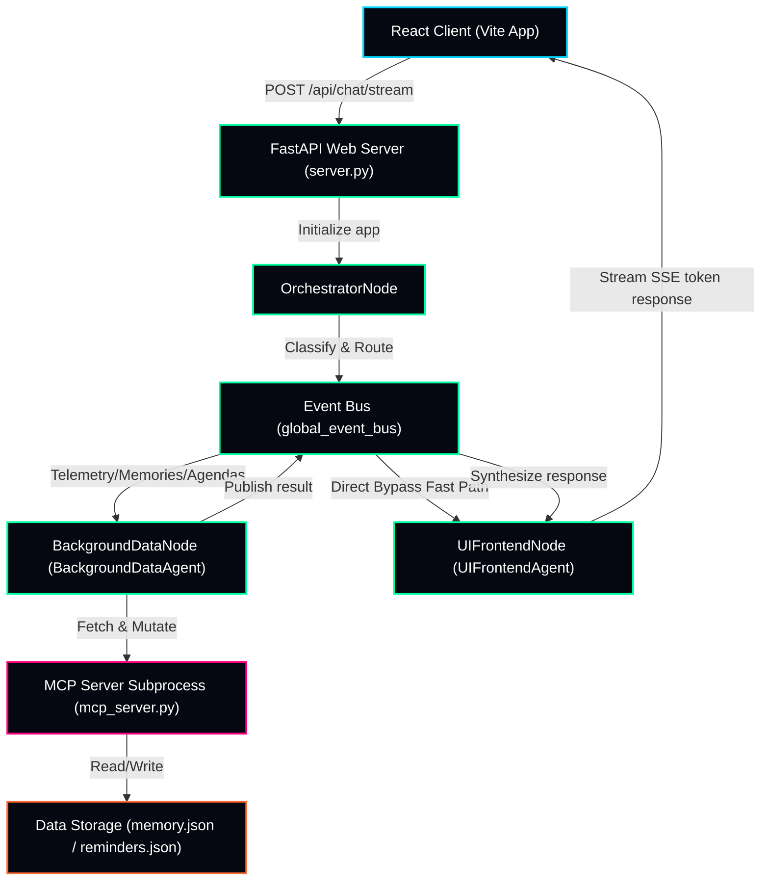

# JARVIS — Event-Driven AI Operating Companion

JARVIS (Just A Rather Very Intelligent System) is a context-aware AI operating companion designed to streamline project delivery, memory management, and agenda coordination. Powered by **Google Agent Development Kit (ADK) 2.0** and **Gemini 2.5**, it hides complex multi-agent event choreographies behind a cinematic, responsive frontend.

---

## 🏗️ System Architecture

JARVIS utilizes an event-driven Agent-to-Agent (A2A) mesh and standard Model Context Protocol (MCP) subprocesses:



---

## 📊 Capability Status Matrix

| Capability | Status | Notes |
|---|---|---|
| **ADK 2.0 GraphAgent** | ✅ | Three-node workflow (`Orchestrator` $\rightarrow$ `BackgroundData` $\rightarrow$ `UIFrontend`) using `@node` routing. |
| **Token Streaming** | ✅ | Server-Sent Events (SSE) pipe partial tokens live into UI message bubbles. |
| **A2A Event Bus** | ✅ | Decoupled asynchronous event contracts mapped with typed Pydantic event payloads. |
| **MCP stdio Transport** | ✅ | Spawns `mcp_server.py` as an isolated subprocess executing JSON-RPC 2.0 queries over `stdin`/`stdout`. |
| **Memory & Deduplication** | ✅ | Fact storage utilizing a `>= 85%` similarity verification threshold (`difflib.SequenceMatcher`). |
| **Mission System** | ✅ | Goal-to-task deconstruction using Operator Context (`CORE_USER_CONTEXT`) to output specific, context-aware milestones. |
| **Voice Input** | ✅ | Browser-native Web Speech API push-to-talk with pulsing sigil animations. |
| **Agenda & Scheduling** | ✅ | CRUD support for daily, weekly, or one-time reminders sorted by urgency tiers. |
| **Session Persistence** | ✅ | Short-term context hydrated from client `localStorage`. |
| **Observability Tracing** | ✅ | Developer diagnostics detailing latency timelines, event logs, and confidence rates. |
| **Production Build** | ✅ | Optimized asset packages compiled through Vite dev engines. |
| **Security Controls** | ✅ | Semgrep static analysis checks, STRIDE threat models, and query injection validation. |

---

## 🚀 Quick Start (Clean Machine)

Follow these steps to launch JARVIS locally:

### Prerequisites
- Python 3.11+
- Node.js 18+

### 1. Environment Setup
1. Clone the repository and navigate to the project directory:
   ```bash
   git clone https://github.com/Mithunvisvesh/jarvis.git
   cd jarvis
   ```
2. Create and activate a Python virtual environment:
   ```bash
   python -m venv .venv
   # Windows:
   .venv\Scripts\activate
   # macOS/Linux:
   source .venv/bin/activate
   ```
3. Install dependencies:
   ```bash
   pip install -r pyproject.toml
   ```
4. Copy the environment template and set your Gemini API key:
   ```bash
   cp .env.example .env
   # Edit .env and enter your GEMINI_API_KEY
   ```

### 2. Running the Application
#### Windows (Single Command)
Run the bat script to launch the backend server and start the frontend client:
```cmd
start_jarvis.bat
```

#### macOS/Linux (Single Command)
Execute the startup shell script:
```bash
chmod +x start_jarvis.sh
./start_jarvis.sh
```

---

## 🛠️ Developer Diagnostics

Toggle **DEVELOPER MODE** under the `SYSTEM` tab in the sidebar to review:
- Latency statistics per agent node.
- Live event bus execution timelines.
- Raw JSON state payloads.
- MCP subprocess connection states.
