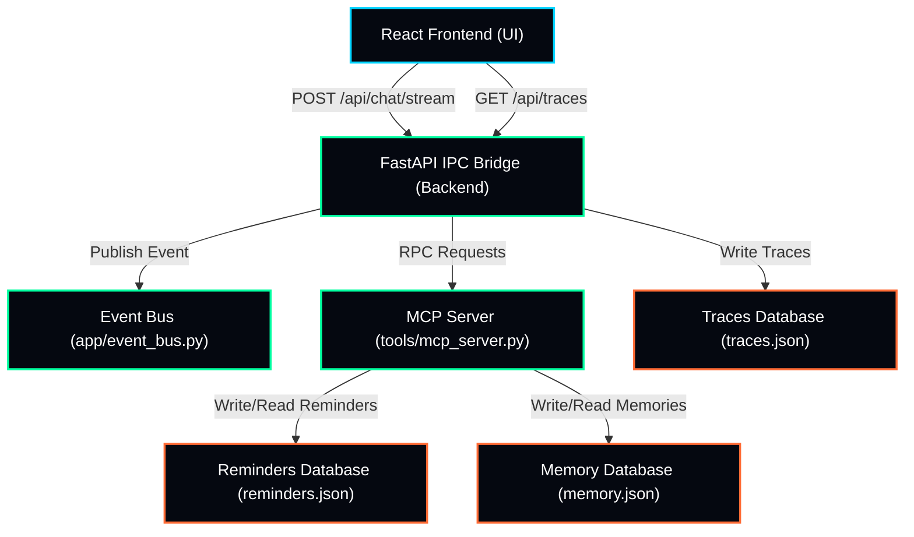
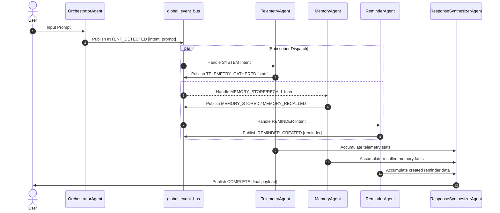
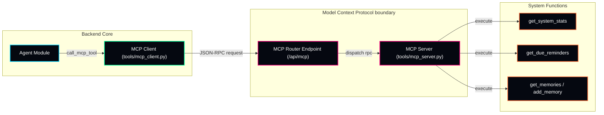

# JARVIS Architecture & Data Flow Reference

This document provides a comprehensive overview of the architectural design, agent collaboration patterns, and tools routing protocols in Project JARVIS.

---

## 1. System Topology Overview

JARVIS is designed as an offline-first, event-driven assistant utilizing a React frontend and a FastAPI backend with integrated local data storage layers.

---

## 2. Event-Driven Agent-to-Agent (A2A) Mesh

JARVIS splits operational tasks among specialized agent modules that communicate asynchronously by publishing and subscribing to strongly-typed event schemas over a central Event Bus.

---

## 3. Model Context Protocol (MCP) Integration

All system tools (getting system stats, saving memories, fetching due reminders) route through the standard MCP Server to maintain absolute API isolation.

