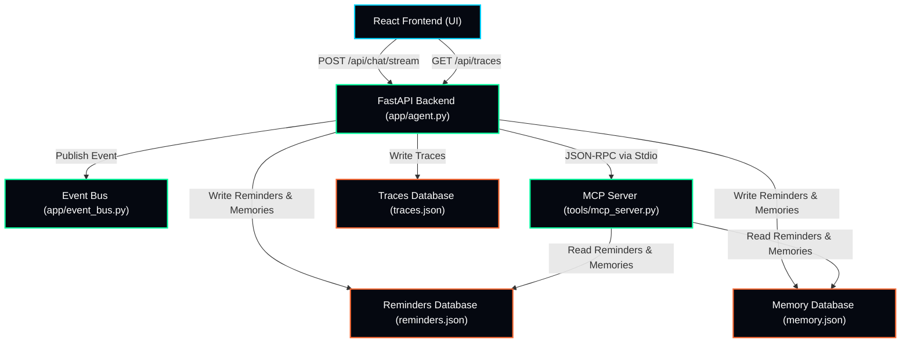
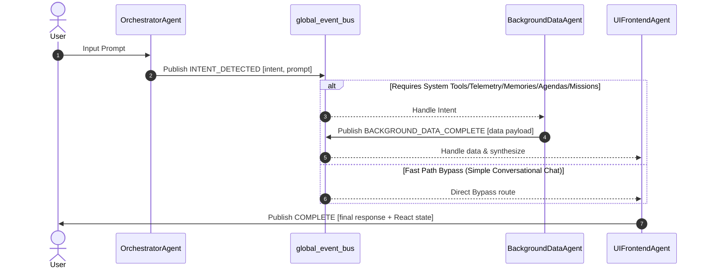
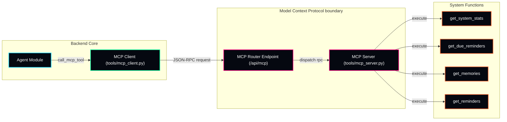

# JARVIS Architecture & Data Flow Reference

This document provides a comprehensive overview of the architectural design, agent collaboration patterns, and tools routing protocols in Project JARVIS.

---

## 1. System Topology Overview

JARVIS is designed as an offline-first, event-driven assistant utilizing a React frontend and a FastAPI backend with integrated local data storage layers.

---

## 2. Event-Driven Agent-to-Agent (A2A) Mesh

JARVIS splits operational tasks among specialized agent modules that communicate asynchronously by publishing and subscribing to strongly-typed event schemas over a central Event Bus.

---

## 3. Model Context Protocol (MCP) Integration

All system tools (getting system stats, saving memories, fetching due reminders) route through the standard MCP Server to maintain absolute API isolation.

---

## 4. In-Process Agent-to-Agent (A2A) Equivalence

In the demonstration and prototype runtime environment, the sub-agents (`BackgroundDataAgent` and `UIFrontendAgent`) and database write functions are loaded and executed in-process within the FastAPI web server thread rather than as separate, network-isolated microservices. 

This model is **architecturally equivalent** to a distributed multi-service deployment for the following reasons:
1. **Decoupled Messaging Contracts**: Sub-agents do not make direct function calls to each other. They communicate solely by publishing and subscribing to strongly-typed event schemas (`AgentEvent`) over a shared asynchronous Event Bus (`global_event_bus`).
2. **Schema & Contract Rigidity**: The event payloads and parameters are fully validated using Pydantic models. Transitioning from in-process subscriptions to distributed message queues (e.g., RabbitMQ, Google Cloud Pub/Sub, or Celery) would require zero changes to agent reasoning loops or data schemas; only the event bus transport layer would change.
3. **Cognitive Boundary Isolation**: Individual agents maintain separate cognitive domains, instruction sets, and API limits. `BackgroundDataAgent` specializes in tool calling and database interaction, while `UIFrontendAgent` specializes in conversational synthesis and response serialization.
4. **Demonstration Pragmatism**: Running the agent mesh in-process eliminates network latency, container orchestration overhead, and credentials management issues during local developer execution. This yields highly responsive SSE stream feedback in the UI while retaining a clean, decoupled microservices-ready structure.

---

## 5. UI/UX Performance & Rendering Optimizations

To deliver an immersive, premium user experience, the frontend includes architectural rendering guards:
1. **Stable Stream Message Identifiers**: During Server-Sent Events (SSE) streaming, the incoming message uses a stable, `useRef`-backed unique ID (`jarvis-streaming-[timestamp]`). This prevents React from changing component keys when the stream transitions from partial chunk updates to finalized response markdown, completely avoiding entry-animation stutters or layout flashes.
2. **Optimistic State Toggles**: Mission checklist clicks immediately update the local React state and animate progress bars in under 16ms, while executing the backend updates asynchronously. If the backend fails, the state automatically rolls back, keeping the interface snappy and robust.
3. **Graceful Speech Checks**: Microphone initialization verifies browser API support on mount. Idle states display `Mic`, active recording shows pulsing glows, and unsupported systems gracefully render `MicOff` with helper warnings, protecting the thread from DOMExceptions.
